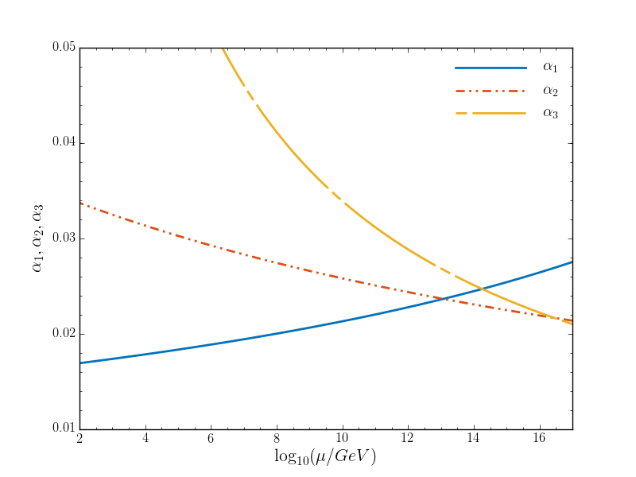
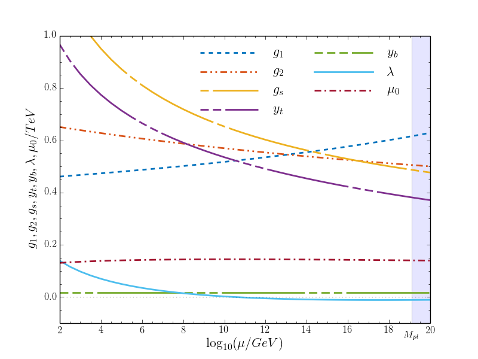
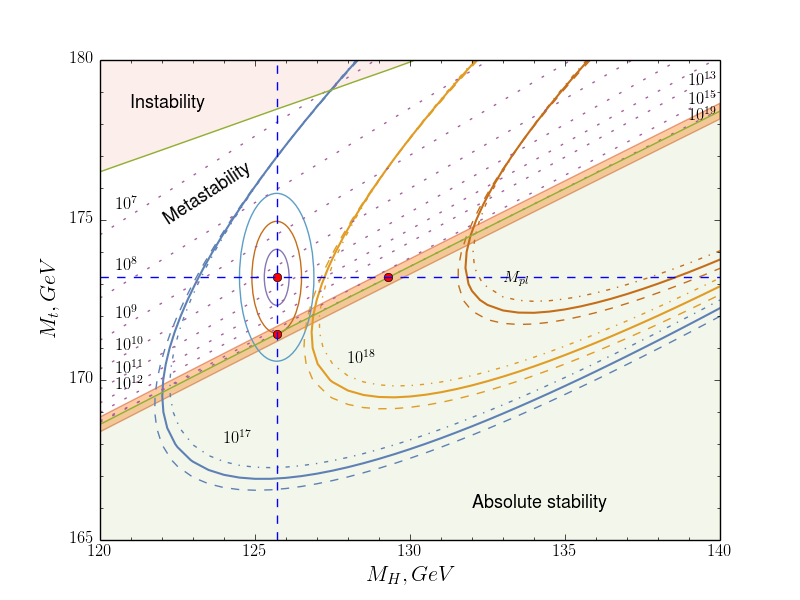

* * * * *
<table style="width:100%">
  <tr>
    <td align="center"><a href="#plots">Plots</a></td>
    <td align="center"><a href="#install">Installation</a></td>
    <td align="center"><a href="#usage">Usage</a></td>
    <td align="center"><a href="#refs">References</a></td>
  </tr>
</table>
[mr:Matching and Running](http://apik.github.io/mr) is a C++ package for NNLO Standard Model stability analysis. It includes full two-loop electroweak threshold corrections connecting input in terms of pole masses with running couplings and three-loop renormalization group equations with additional higher order QCD corrections for evolution of running couplings up to a needed scale. 
For package overview see [hep-ph/1601.08143](http://inspirehep.net/record/1418484).
<iframe src="http://ghbtns.com/github-btn.html?user=apik&amp;repo=mr&amp;type=watch&amp;count=true&amp;size=large"
  allowtransparency="true" frameborder="0" scrolling="0" width="170" height="30"></iframe> 

## Sample plots

<figure>
  
  <figcaption>Gauge couplings unification region. 
    <a href="plots/gauge123.svg">[SVG]</a> <a href="plots/gauge123.pdf">[PDF]</a></figcaption>	
</figure>	      	

<figure>
  
  <figcaption>Standard Model couplings running up to a Planck scale. 
    <a href="plots/cEvol.svg">[SVG]</a>,<a href="plots/cEvol.pdf">[PDF]</a></figcaption>	
</figure>	      	

<figure>
  
  <figcaption>Phase plot in terms of top and Higgs mass. 
    <a href="plots/stable.svg">[SVG]</a>,<a href="plots/stable.pdf">[PDF]</a></figcaption>	
</figure>	      	

For example application see:

*[Stability of the Electroweak Vacuum: Gauge Independence and Advanced Precision.](http://inspirehep.net/record/1385870)
By A.V. Bednyakov, B.A. Kniehl, A.F. Pikelner, O.L. Veretin.
Phys.Rev.Lett. 115 (2015) 20, 201802.*

## Installation

Latest release is available from [github release page](https://github.com/apik/mr/releases/latest)

From github repository using git:

~~~
$ git clone https://github.com/apik/mr.git
$ cd mr
$ autoreconf -i
$ ./configure
$ make && make install
~~~

Or downloading tarball and extracting:

~~~
$ curl -OL https://github.com/apik/mr/releases/download/v1.0/mr-1.0.tar.gz
$ tar zxf mr-1.0.tar.gz
$ cd mr-1.0
$ ./configure
$ make && make install
~~~

## Usage

Main use case is the following chain of procedure calls. At first step using input in terms of pole masses and Fermi constant obtain running couplings at specified matching scale. 


// Input in terms of pole masses
OSinput oi(pdg2014::Mb, pdg2014::MW, pdg2014::MZ, pdg2014::MH, pdg2014::Mt);
// Running QCD coupling as(Mt) from as(MZ)
AlphaS as(oi);
// Set of all running parameters at scale Mt
P2MS pMSmt(oi,pdg2014::Gf, as(oi.Mt()), oi.Mt(), order::all);
// Running Yukawa top at top mass
std::cout << sqrt(pMSmZ.at())*4*Pi << std::endl


At the next step we perform  evolution from matching scale up to scale
of interest.  We use  3-loop RGE  for all  SM couplings  except Yukawa
tau.  Two  last  parameters  specify orders  for  running  Higgs  mass
parameter  and   vacuum  expectation  value.

Couplings<3,3,3,3,3,0,3,3,0>  av(pMSmt);
//  vector of  couplings  at scale  mu=10^19
SMCouplings  v  =  avP2MS(pow(10,2*19));
std::cout  << sqrt(v[couplings::yt])*4.*Pi << std::endl;


* * * * *

## References

### SM running

*  *[Anomalous dimensions of gauge fields and gauge coupling
beta-functions in the Standard Model at three loops.](http://inspirehep.net/record/1193366)
By A.V. Bednyakov, A.F. Pikelner, V.N. Velizhanin.
JHEP 1301 (2013) 017.*
*  *[Yukawa coupling beta-functions in the Standard Model at three
loops.](http://inspirehep.net/record/1208862)
By A.V. Bednyakov, A.F. Pikelner, V.N. Velizhanin.
Phys.Lett. B722 (2013) 336-340.*
*  *[Higgs self-coupling beta-function in the Standard Model at three
loops.](http://inspirehep.net/record/1224266)
By A.V. Bednyakov, A.F. Pikelner, V.N. Velizhanin.
Nucl.Phys. B875 (2013) 552-565.*

### Threshold corrections
*  *[Two-loop electroweak threshold corrections in the Standard Model.](http://inspirehep.net/record/1351233)
By Bernd A. Kniehl, Andrey F. Pikelner, Oleg L. Veretin.
Nucl.Phys. B896 (2015) 19-51.*

### Additional tools

Two-loop massive self-energy integrals evaluated numerically using TSIL
library:

* *[TSIL: A Program for the calculation of two-loop self-energy
integrals.](http://inspirehep.net/record/675010)
By Stephen P. Martin, David G. Robertson.
Comput.Phys.Commun. 174 (2006) 133-151.*

Effective potential up to three loops in SM in gaugless limit:

*  *[Three-loop Standard Model effective potential at leading order in
strong and top Yukawa couplings.](http://inspirehep.net/record/1262358)
By Stephen P. Martin.
Phys.Rev. D89 (2014) 1, 013003.*

Four-loop QCD corrections to strong and Yukawa couplings running:

*  *[The Four loop beta function in quantum chromodynamics.](http://inspirehep.net/record/439866)
By T. van Ritbergen, J.A.M. Vermaseren, S.A. Larin.
Phys.Lett. B400 (1997) 379-384.*
*   *[The four loop quark mass anomalous dimension and the invariant
quark mass.](http://inspirehep.net/record/441078)
By J.A.M. Vermaseren, S.A. Larin, T. van Ritbergen.
Phys.Lett. B405 (1997) 327-333.*

## Contacts
Andrey Pikelner, *pikelner[at]theor.jinr.ru*

### License

[GPLv3 License](https://www.gnu.org/licenses/gpl.html)

<!-- 

<a href="https://github.com/chibicode/solo" style="font: 700 13px &quot;Helvetica Neue&quot;, Helvetica, Arial, sans-serif;color: #fff;text-decoration: none;text-shadow: 0 -1px rgba(0, 0, 0, 0.5);text-align: center;width: 200px;line-height: 20px;display: inline-block;padding: 2px 0;border-width: 1px 0;border-style: dotted;border-color: rgba(255, 255, 255, 0.7);">Fork me on GitHub</a>

 -->
